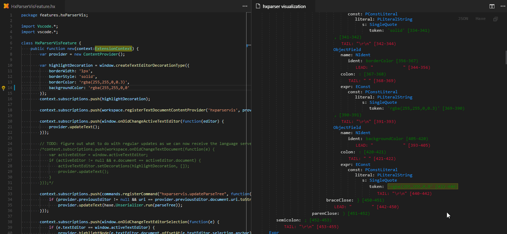

# Haxe Extension Debug Tools

[](https://travis-ci.org/vshaxe/vshaxe-debug-tools)

This is a VSCode extension that exists solely to aid the development of the [vshaxe](https://github.com/vshaxe/vshaxe) extension.

## Features

- **hxparser Syntax Tree Visualizer**

  The `hxparser: Visualize` commands opens a new editor to the side that displays the [hxparser](https://github.com/vshaxe/hxparser) / [](https://github.com/vshaxe/haxe-hxparser) parse tree for the current Haxe source file. Selecting tokens in the source will scroll to the appropriate position in the tree, and selecting tokens in the tree will highlight the token in the source.

  

  When changing the file, the tree is updated with [haxe-languageserver](https://github.com/vshaxe/haxe-languageserver)'s internal parse tree (obtained through incremental parsing).

  It's also possible to view the original JSON response from hxparser or to view the parse tree re-printed as Haxe code.

- **haxe-formatter test file highlighting**

  [haxe-formatter](https://github.com/vshaxe/haxe-formatter) uses a custom `.hxtest` file extension for unit test definitions. These files are highlighted by the debug tools:

  

- **Cursor Byte Offset Status Bar Item**

  

  The debug tools add a status bar item displaying the current cursor byte offset when in a Haxe file. Haxe `--display` queries require the cursor byte offset as an argument, making this feature very useful when isolating and reproducing bugs.

- **vshaxe-build Project Schema**

  [vshaxe-build](https://github.com/vshaxe/vshaxe-build) uses `vshaxe-build.json` files for project configuration. This extension includes a schema for them:

  

## Installation

1. Navigate to the extensions folder (`C:\Users\<username>\.vscode\extensions` on Windows, `~/.vscode/extensions` otherwise)
2. Clone this repo: `git clone --recursive https://github.com/vshaxe/vshaxe-debug-tools`.
3. Change current directory to the cloned one: `cd vshaxe-debug-tools`.
4. Install the build tool: `haxelib git vshaxe-build https://github.com/vshaxe/vshaxe-build`
5. To build everything (as well as install all dependencies):

    ```
    haxelib run vshaxe-build --target all --mode both
    ```

6. After modifying and rebuilding the extension itself, restart VSCode, reload the window or run a debug instance with F5 ([standard vscode workflow](https://code.visualstudio.com/docs/extensions/debugging-extensions)).